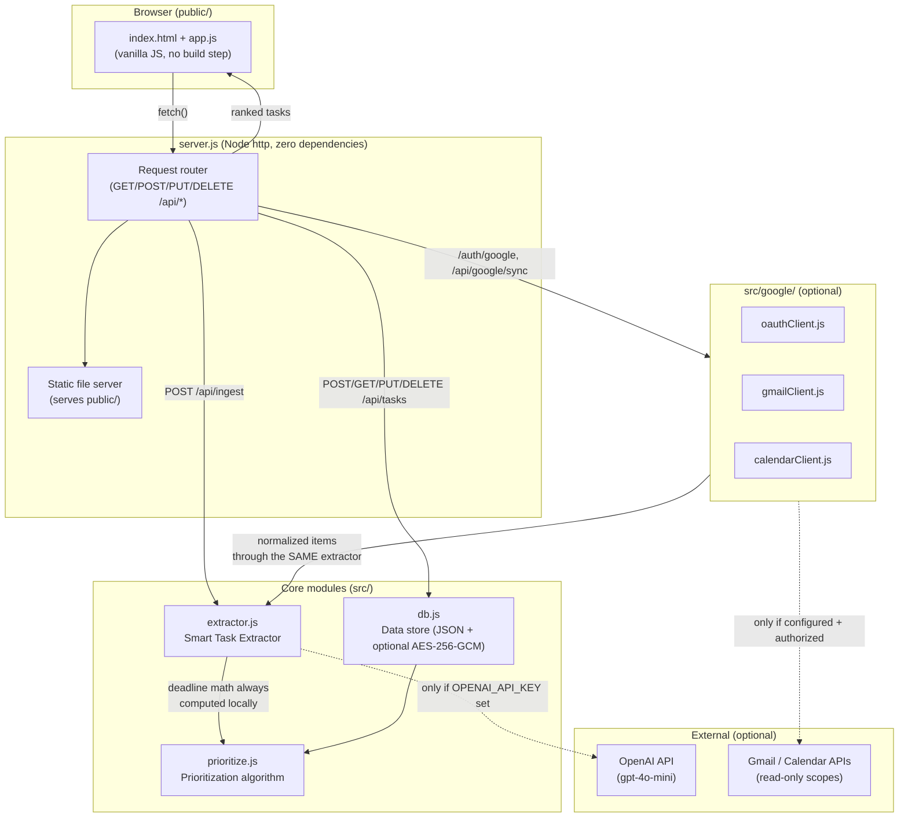
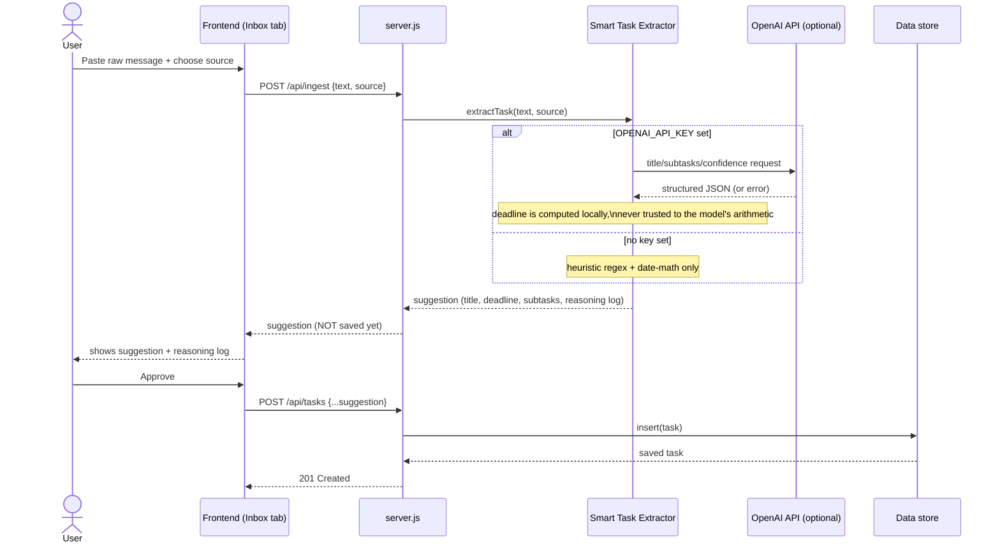
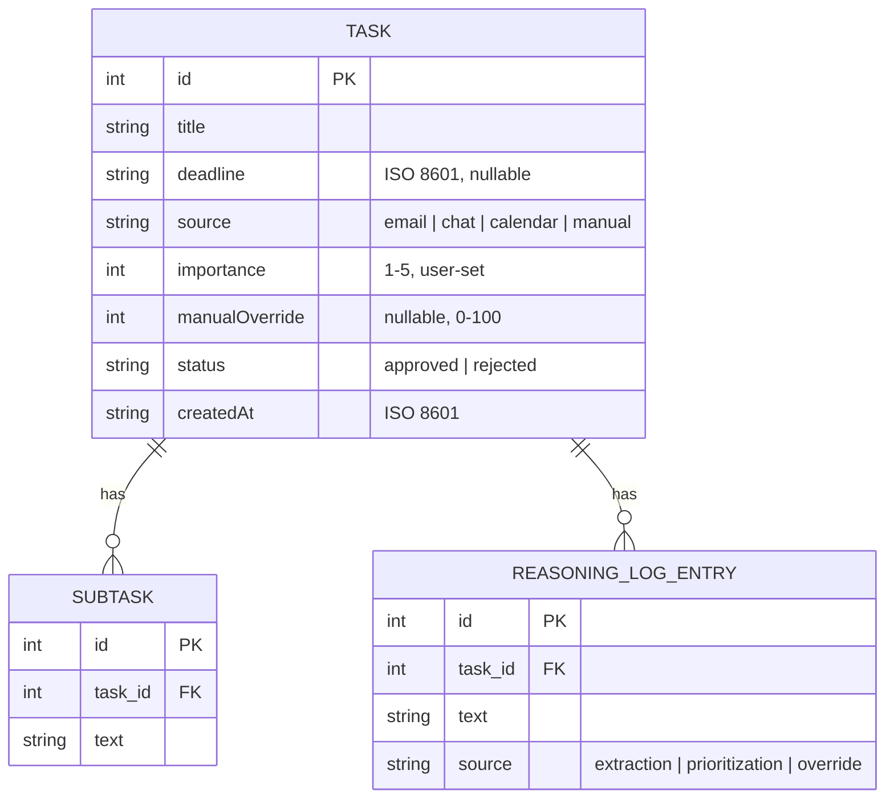

# Architecture

## System overview

WorkWise AI is a single deployable unit for the final release: one Node.js
process serves both the REST API and the static frontend. This is a
deliberate simplification from the target three-tier stack (see
[ADR 0001](./adr/0001-tech-stack.md)) chosen to keep the alpha/final
runnable with zero install steps; the module boundaries below are drawn so
that each piece can be swapped independently without touching the others.

## Human-in-the-loop data flow

This is the flow the pitch's risk analysis specifically asked for: nothing
from the AI extractor is ever persisted without a human approving it first.

## Why this differs from the original target stack

| Target stack (original pitch) | What's implemented | Why |
|---|---|---|
| React frontend | Plain HTML/CSS/JS in `public/` | Zero build step; anyone can run it with `npm start` and no `npm install` of a frontend toolchain. See [ADR 0001](./adr/0001-tech-stack.md). |
| Node.js + Express | Node's built-in `http` module | Same route surface (`/api/tasks`, `/api/ingest`); Express can be dropped in later purely as routing sugar without changing the API contract. |
| PostgreSQL | Both: JSON file by default, or PostgreSQL automatically when `DATABASE_URL` is set | See [ADR 0002](./adr/0002-data-store.md), [ADR 0005](./adr/0005-postgres-on-render.md), and the [ER diagram](#data-model--er-diagram) below. |
| OAuth/JWT auth | Simulated single-user environment | Documented, deliberate scope cut from the team's own revised Week 1-4 backlog; see [ADR 0003](./adr/0003-auth-deferral.md). |

## Data model (ER diagram)

The JSON store's shape mirrors the relational schema it became: moving to
PostgreSQL was a matter of implementing `src/db/json-store.js`'s existing
function signatures (`getAll`, `getById`, `insert`, `update`, `remove`)
against SQL rather than a redesign — see `src/db/postgres-store.js` and
[ADR 0005](./adr/0005-postgres-on-render.md).

In the current JSON store, `SUBTASK` and `REASONING_LOG_ENTRY` are embedded
arrays on the task object rather than separate rows — the natural
document-shaped equivalent of the same relationship. The actual PostgreSQL
implementation (`src/db/postgres-store.js`) keeps this same shape rather
than fully normalizing into separate tables: `subtasks` and
`extraction_reasoning` are `JSONB` columns, not foreign-keyed child
tables. This was a deliberate scope decision, not an oversight — at this
project's scale there's no query that needs to join against an individual
subtask or log line, so the added complexity of real child tables (and
the join logic every read would need) wouldn't earn its cost. Full
normalization into the diagram above is the natural next step if a
feature ever needs to query into that data directly (e.g., "find all
tasks with an overdue subtask").

## Module responsibilities

- **`server.js`** — HTTP routing only. No business logic lives here; it
  delegates to `src/*` and serves `public/`.
- **`src/extractor.js`** — turns raw text into a *suggested* task. Never
  writes to the data store directly.
- **`src/prioritize.js`** — pure functions: given a task, compute a score
  and a reasoning log. No I/O.
- **`src/db/`** — the only module that touches storage for task data.
  `src/db/index.js` picks JSON-file or PostgreSQL automatically based on
  `DATABASE_URL`; encryption at rest (JSON mode) is handled transparently
  inside `json-store.js`. Nothing above this layer needs to know which
  backend is active.
- **`src/search.js`** — pure, stateless task filtering by keyword
  (title/subtasks/source), used by `GET /api/tasks?q=...`. No I/O.
- **`src/google/`** — optional Gmail/Calendar integration (OAuth2 +
  read-only REST calls, no SDK dependency — see
  [ADR 0004](./adr/0004-google-integration.md)). Feeds normalized items
  into the same `extractTask()` pipeline as manually pasted text, so the
  human-approval rule applies identically either way. Fully inert if
  `GOOGLE_CLIENT_ID`/`GOOGLE_CLIENT_SECRET` aren't set.
- **`public/`** — no build step, no framework; talks to the backend only
  through `fetch()` calls to `/api/*`.
