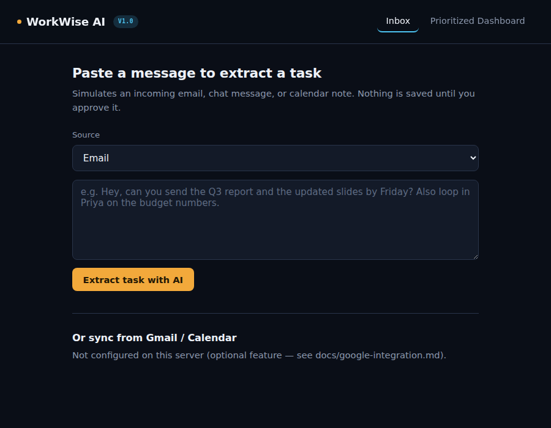
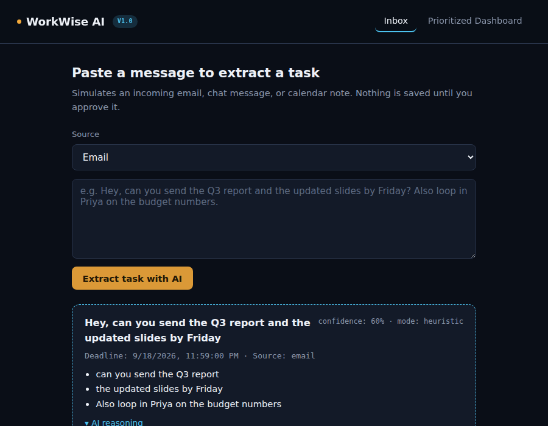
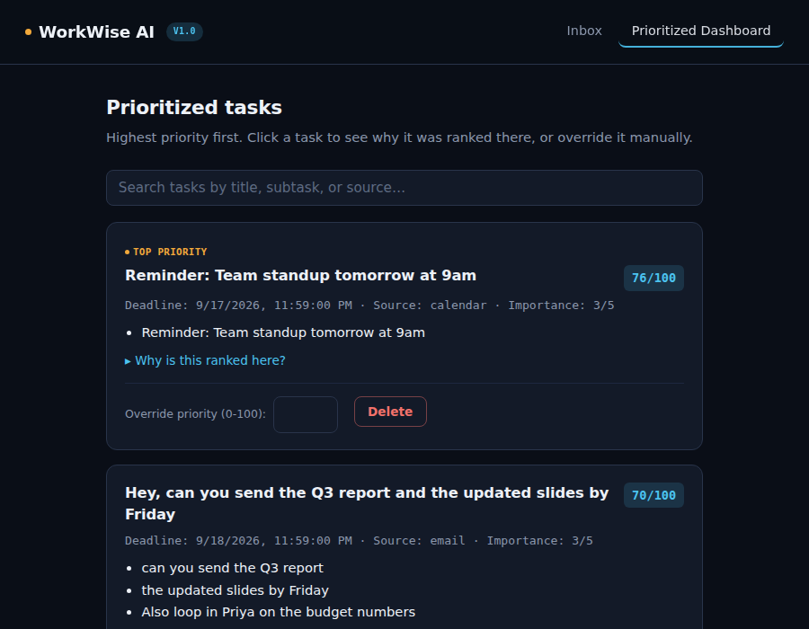
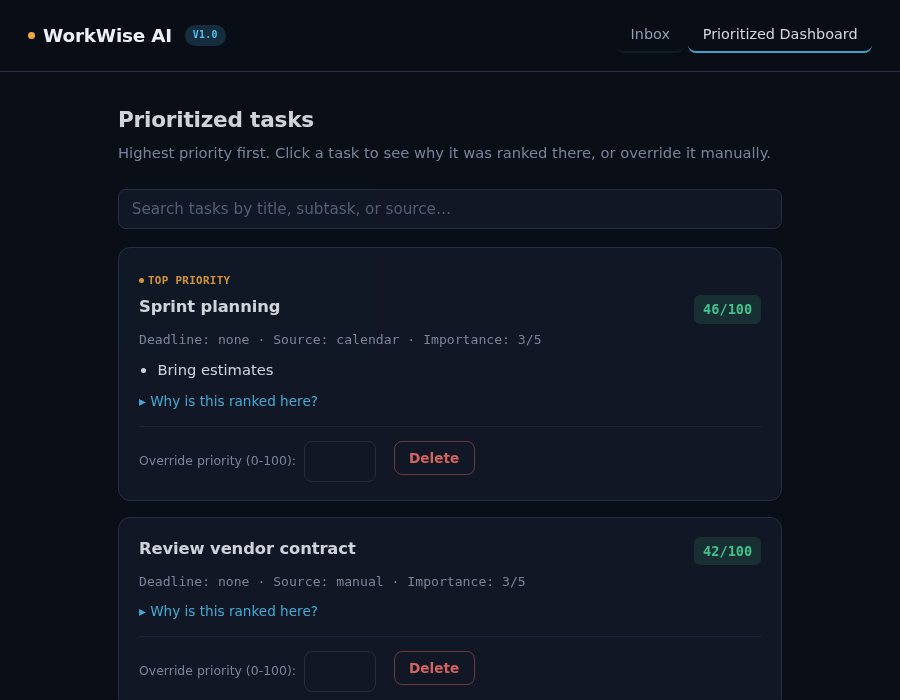
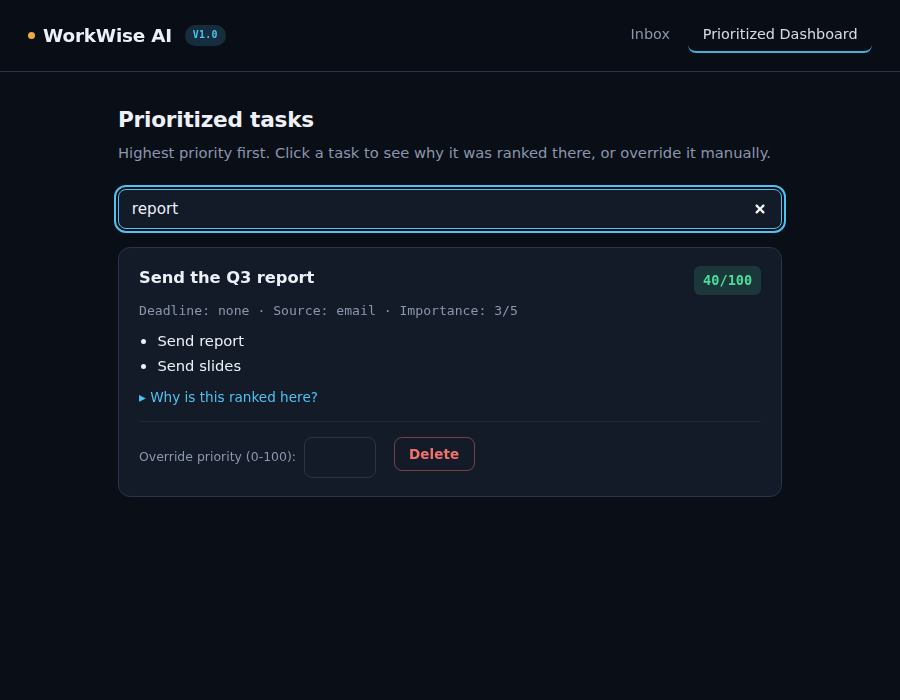
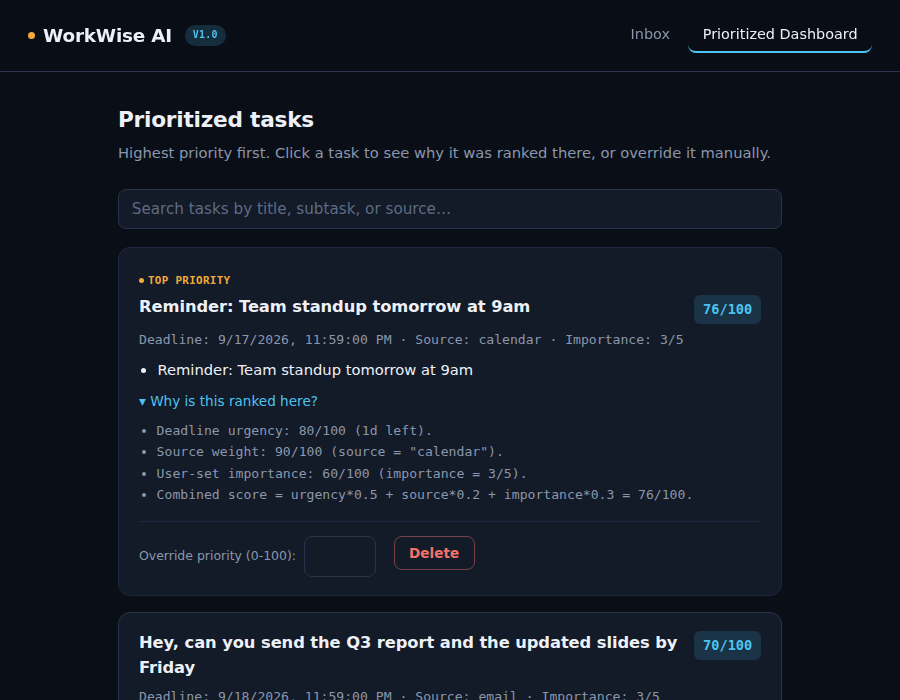
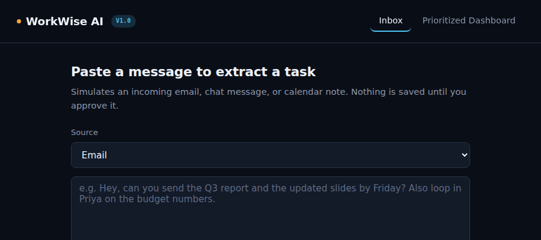
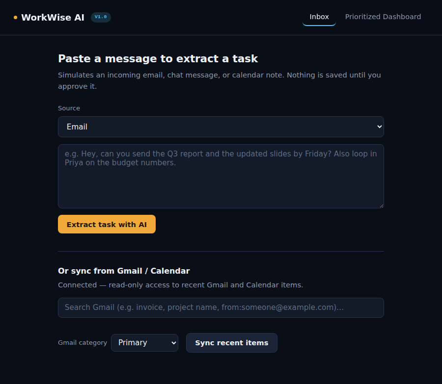

# User Manual

This walks through using WorkWise AI once it's running (see the
[README](../README.md) for installation).

## 1. The Inbox tab

When you open the app, you land on the **Inbox** tab. This is where you
paste in a raw message — an email, a chat message, or a calendar note —
and choose which source it came from.

## 2. Extracting a task with AI

Paste your message and click **Extract task with AI**. The Smart Task
Extractor reads the message and suggests a title, a deadline (if it found
one), and a list of subtasks — along with a "why" explanation of how it
arrived at each part.

**Nothing is saved at this point.** You have two choices:
- **Approve & save** — the task is added to your dashboard
- **Reject** — the suggestion is discarded; nothing is written anywhere

This human-approval step is not optional or skippable in the UI — it's a
direct response to the "AI parsing inaccuracies" risk identified in the
original project pitch.

## 3. The Prioritized Dashboard

Once you've approved one or more tasks, switch to the **Prioritized
Dashboard** tab. Tasks are ranked highest-priority first, based on
deadline proximity, where the task came from, and how important you've
marked it.

Each task card shows:
- The **priority score** (0–100) in the top right
- The **deadline, source, and importance**
- The **subtasks** the AI identified
- A **"Why is this ranked here?"** expandable reasoning log
- An **override box** where you can type your own priority number,
  overriding the algorithm entirely
- A **Delete** button

### Searching your tasks

Above the task list, a search box lets you filter by keyword — matching
against a task's title, its subtasks, or where it came from (email,
chat, calendar, manual), similar to Gmail's own search bar. It updates
as you type, and clearing the box shows every task again.

## 4. Understanding the reasoning log

Click "Why is this ranked here?" on any task to see exactly how its score
was calculated — this is the transparency feature that addresses the
"poor prioritization" risk from the pitch. Nothing about the ranking is a
black box.

## 5. Overriding a priority manually

If you disagree with where a task landed, type a number (0–100) into its
override box and it takes effect immediately — the reasoning log will
show "Manually set to priority N by the user, overriding the algorithm"
instead of the calculated breakdown. Clear the box to hand control back to
the algorithm.

## 6. Syncing from Gmail / Calendar (optional)

Below the manual paste form, there's an "Or sync from Gmail / Calendar"
section. This is entirely optional — see
[docs/google-integration.md](./google-integration.md) for full setup.

If this isn't configured on your server, it just says so and stays out
of the way — the rest of the app works exactly the same either way. Once
connected, you'll see a **Gmail category** dropdown before syncing:

This maps directly to Gmail's own inbox tabs:
- **Primary** (default) — the tab Gmail already reserves for
  person-to-person email; the most likely place for real tasks to
  show up, and the sensible default so promotional/social noise doesn't
  flood the extractor
- **Promotions**, **Social**, **Updates**, **Forums** — Gmail's other
  tabs, in case something actionable landed there instead
- **All (no filter)** — skips the category filter entirely

### Searching before you sync

Above the category dropdown, a search box lets you search Gmail
directly — the same as typing into Gmail's own search bar. Type a term
and either press **Enter** or click **Sync recent items**.

Gmail's own search operators work here too, since this is passed
straight through to Gmail's real search API — for example
`from:someone@example.com`, `has:attachment`, or a quoted `"exact phrase"`.
The search also applies to the Calendar portion of the sync, as a
simple substring match against each event's title and description
(Calendar's API doesn't have Gmail's rich search syntax, so this part is
simpler by necessity).

Clicking **Sync recent items** pulls your last 7 days of email in the
selected category, plus upcoming calendar events, through the same
extractor and approval flow as the manual paste box — nothing is saved
without your review here either.

## 7. Turning on real AI extraction (optional)

By default, extraction runs in **heuristic mode** — built-in pattern
matching, no API key, no internet call required. If you'd like real LLM
extraction instead, see the "Turning on real AI extraction" section of
the [README](../README.md#6-optional-turning-on-real-ai-extraction).

You can tell which mode produced a given suggestion by the `mode` badge
shown on the suggestion card (`heuristic` or `llm`).

## Troubleshooting

| Symptom | Likely cause |
|---|---|
| Suggestion always says `mode: heuristic` even with a key set | You started with `npm start` instead of `npm run start:with-ai` — the plain script never reads `.env` |
| Server errors with "Data file is encrypted but DATA_ENCRYPTION_KEY is not set" | You previously ran with encryption on; either set the same key again, or delete `data/tasks.json` to start fresh (this deletes existing tasks) |
| A deadline looks wrong | Check the reasoning log on that task/suggestion — it states which pattern matched and how the date was computed, which is usually enough to spot why |
